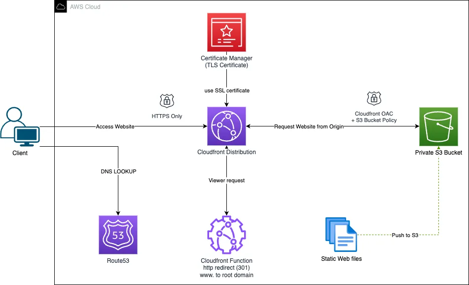

# **AWS Static Website Deployment with Terraform** 🚀

## **Overview**
This project demonstrates the deployment of a **static portfolio website** on **AWS**, leveraging **Terraform** for Infrastructure as Code (**IaC**). The solution is **highly available, secure, and cost-effective**, making it ideal for personal or business portfolios.

## **Architecture**
The deployment follows a **serverless architecture** to host and serve static content efficiently:
- **Amazon S3**: Securely hosts static website files.
- **CloudFront**: Speeds up content delivery globally.
- **Route 53**: Manages domain name resolution and custom domains.
- **AWS Certificate Manager**: Ensures secure **HTTPS** communication.
- **GitHub Actions**: Automates deployment workflows.
- **Terraform**: Manages infrastructure provisioning and updates.

---

## **Features**
✅ **Scalable & Secure** – Uses **CloudFront OAC** for private access to S3.  
✅ **Automated Deployments** – GitHub Actions push updates to S3 via Terraform.  
✅ **Custom Domain & HTTPS** – AWS Route 53 manages domain routing with SSL encryption.  
✅ **Infrastructure as Code (IaC)** – Easily reproduce deployments with Terraform.  

